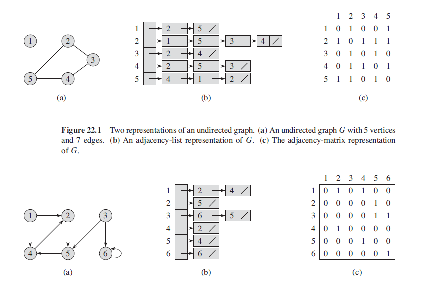
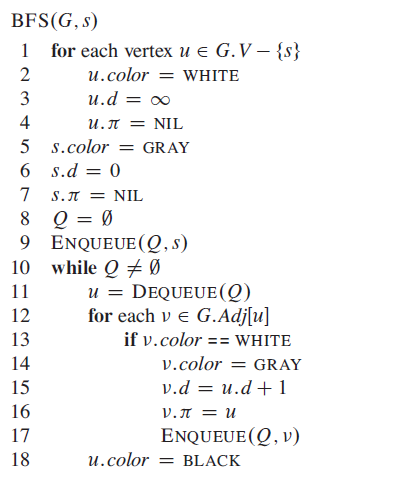
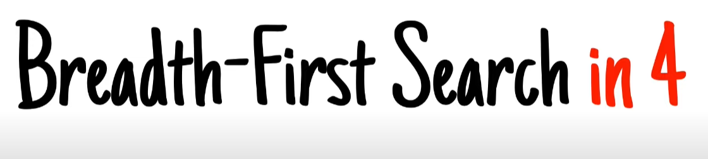
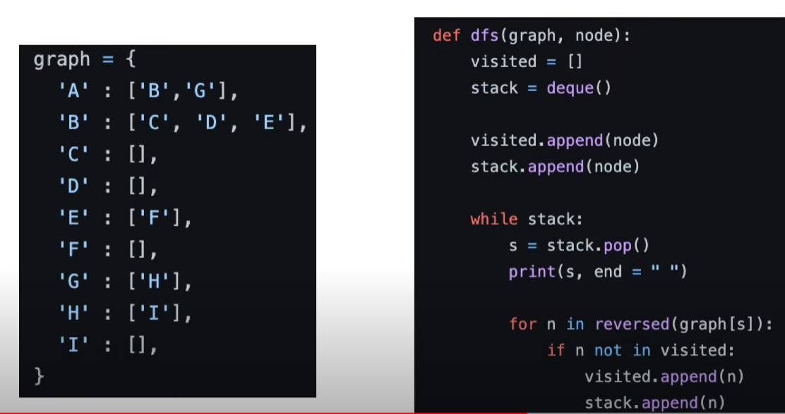
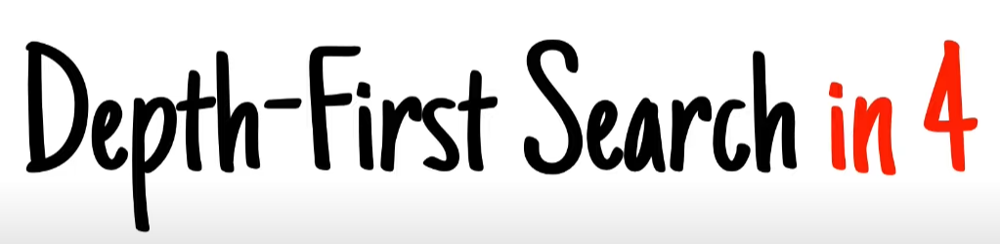
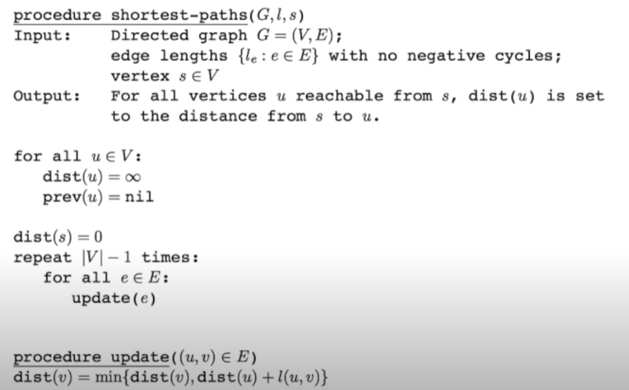
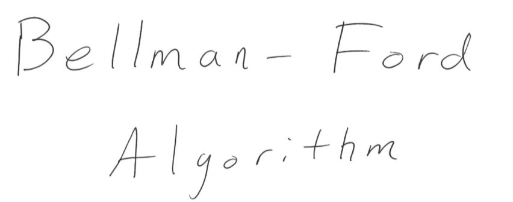
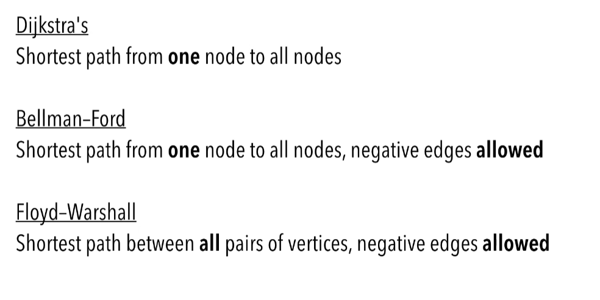
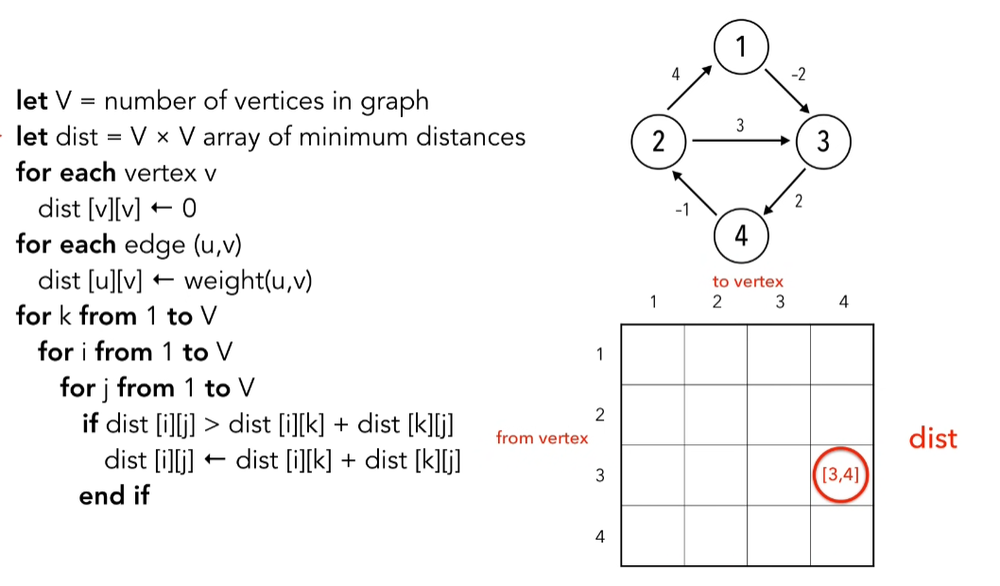
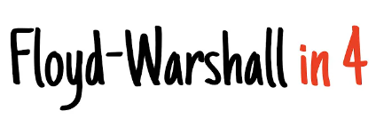

# Graphs

### Definition

A graph (sometimes called undirected graph for distinguishing from a 
directed graph, or simple graph for distinguishing from a multigraph)
is a pair G = (V, E), where V is a set whose elements are called vertices
(singular: vertex), and E is a set of paired vertices, whose elements are 
called edges (sometimes links or lines).

- Vertex: In Figure 1, nodes such as A, B, and C are called vertices of the graph.
- Edge: The connection between two vertices are the edges of the graph. In Figure 1, the connection between person A and B is an edge of the graph.
- Path: the sequence of vertices to go through from one vertex to another. In Figure 1, a path from A to C is [A, B, C], or [A, G, B, C], or [A, E, F, D, B, C].
- **Note**: there can be multiple paths between two vertices.

- Path Length: the number of edges in a path. In Figure 1, the path lengths from person A to C are 2, 3, and 5, respectively.
- Cycle: a path where the starting point and endpoint are the same vertex. In Figure 1, [A, B, D, F, E] forms a cycle. Similarly, [A, G, B] forms another cycle.
- Negative Weight Cycle: In a “weighted graph”, if the sum of the weights of all edges of a cycle is a negative value, it is a negative weight cycle. In Figure 4, the sum of weights is -3.
- Connectivity: if there exists at least one path between two vertices, these two vertices are connected. In Figure 1, A and C are connected because there is at least one path connecting them.
- Degree of a Vertex: the term “degree” applies to unweighted graphs. The degree of a vertex is the number of edges connecting the vertex. In Figure 1, the degree of vertex A is 3 because three edges are connecting it.
- In-Degree: “in-degree” is a concept in directed graphs. If the in-degree of a vertex is d, there are d directional edges incident to the vertex. In Figure 2, A’s indegree is 1, i.e., the edge from F to A.
- Out-Degree: “out-degree” is a concept in directed graphs. If the out-degree of a vertex is d, there are d edges incident from the vertex. In Figure 2, A’s outdegree is 3, i,e, the edges A to B, A to C, and A to G.

---

### Algorithms

#### Breadth-first search

**Video**

---

#### Depth-first search

**Video**

---

#### Bellman–Ford algorithm

The Bellman–Ford algorithm is an algorithm that computes shortest paths from a single source vertex to all of the other vertices in a weighted digraph.[1] It is slower than Dijkstra's algorithm for the same problem, but more versatile, as it is capable of handling graphs in which some of the edge weights are negative numbers.

**Video**

---

#### Dijkstra's algorithm

Dijkstra's algorithm (/ˈdaɪkstrəz/ DYKE-strəz) is an algorithm for finding the shortest paths between nodes in a graph, which may represent, for example, road networks.

**Video**

---

#### Floyd–Warshall algorithm

In computer science, the Floyd–Warshall algorithm (also known as Floyd's algorithm, the Roy–Warshall algorithm, the Roy–Floyd algorithm, or the WFI algorithm) is an algorithm for finding shortest paths in a directed weighted graph with positive or negative edge weights (but with no negative cycles).

**Video**

---

#### Prim's algorithm

In computer science, Prim's algorithm (also known as Jarník's algorithm) is a greedy algorithm that finds a minimum spanning tree for a weighted undirected graph. This means it finds a subset of the edges that forms a tree that includes every vertex, where the total weight of all the edges in the tree is minimized.

**Video**

---

#### Kruskal's algorithm

Kruskal's algorithm finds a minimum spanning forest of an undirected edge-weighted graph. If the graph is connected, it finds a minimum spanning tree. (A minimum spanning tree of a connected graph is a subset of the edges that forms a tree that includes every vertex, where the sum of the weights of all the edges in the tree is minimized.

**Video**

