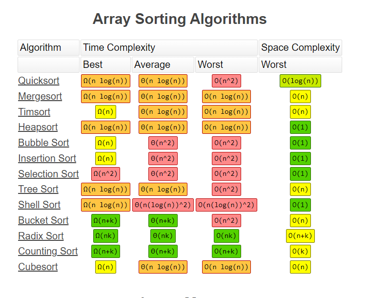
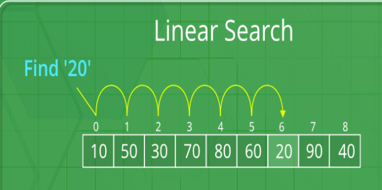
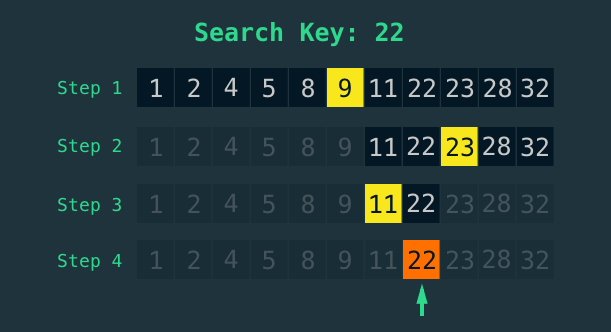

# Search algorithms

---

### Linear search

Linear search is a sequential searching algorithm where we start from
one end and check every element of the list until the desired element is found. 
It is the simplest searching algorithm.

#### Performance

Worst-case performance -	O(n)

Best-case performance -	O(1)

Average performance -	O(n/2)

Worst-case space complexity -	O(1)

---

### Binary search

Binary search is an efficient algorithm for finding an item from
a sorted list of items. It works by repeatedly dividing in half the portion
of the list that could contain the item,
until you've narrowed down the possible locations to just one.

#### Performance

Worst-case performance -	O(log n)

Best-case performance -	O(1)

Average performance -	O(log n)

Worst-case space complexity -	O(1)