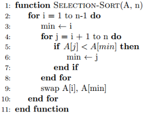

# Sorting algorithms
---

### Bubble sort

Bubble Sort is the simplest sorting algorithm that works by repeatedly 
swapping the adjacent elements if they are in the wrong order.

#### Illustration

**Video**

#### Performance

---

### Insertion sort

Insertion sort is a simple sorting algorithm that works similar to the 
way you sort playing cards in your hands. The array is virtually split into 
a sorted and an unsorted part. Values from the unsorted part
are picked and placed at the correct position in the sorted part.

#### Illustration

**Video**

#### When to use and when don't

Use insertion sort in the following scenarios:

- When the array is nearly sorted - since insertion sort is adaptive
- When we have memory usage constraints
- When a simple sorting implementation is desired
- When the array to be sorted is relatively small
- When you need to sort elements online - that is sorting them as they come in.

Avoid using insertion sort when:

- The array to be sorted has a large number of elements
- The array is completely  unsorted
- You want a faster run time and memory is not a concern.

#### Performance

---

### Selection sort

The selection sort algorithm sorts an array by repeatedly finding 
the minimum element (considering ascending order) from unsorted part and
putting it at the beginning. 
The algorithm maintains two subarrays in a given array.

#### Illustration

**Video**

#### When to use and when don't

Use selection sort in the following scenarios:

- When the array is NOT partially sorted
- When we have memory usage constraints
- When a simple sorting implementation is desired
- When the array to be sorted is relatively small

Avoid using Selection sort when:

- The array to be sorted has a large number of elements
- The array is nearly sorted
- You want a faster run time and memory is not a concern.

#### Performance

---

### Counting sort
(Sort only positive integers)

Counting sort is a sorting algorithm that sorts the elements of an array 
by counting the number of occurrences of each unique element in the array. 
The count is stored in an auxiliary array and the sorting is done by mapping the count as an index of the auxiliary array.

#### Illustration

**Video**

#### When to use and when don't

- This sorting technique is effective when the difference between different keys are not so big, otherwise, it can increase the space complexity.
- Counting sort makes assumptions about the data, for example, it assumes that values are going to be in the range of 0 to 10 or 10 – 99 etc, Some other assumptions counting sort makes are input data will be all real numbers.
- Like other algorithms this sorting algorithm is not a comparison-based algorithm, it hashes the value in a temporary count array and uses them for sorting.
#### Performance

---

### Radix sort

**What if the elements are in the range from 1 to n2?**
We can’t use counting sort because counting sort will
take O(n2) which is worse than comparison-based sorting algorithms. Can we sort such an array in linear time?

Radix Sort is the answer. The idea of Radix Sort is to do digit by digit sort starting from
least significant digit to most significant digit. Radix sort uses counting sort as a subroutine to sort.

#### Illustration

**Video**

#### When to use and when don't

- It makes assumptions about the data like the data must be between a range of elements.
- Input array must have the elements with the same radix and width.
- Radix sort works on sorting based on individual digit or letter position.
- We must start sorting from the rightmost position and use a stable algorithm at each position.
- Radix sort is not an in-place algorithm as it uses temporary count array.

#### Performance

---

### Merge sort

It divides the input array into two halves,
calls itself for the two halves, and then it merges the two sorted halves. 
The merge() function is used for merging two halves. The merge(arr, l, m, r) is a key 
process that assumes that arr[l..m] and arr[m+1..r] are sorted and merges the two sorted sub-arrays into one.

#### Illustration

**Video**

#### When to use and when don't

#### Performance

---
