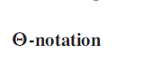
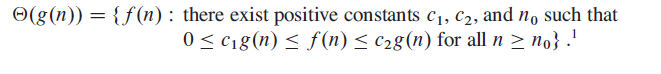
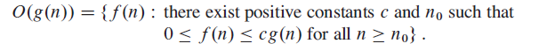
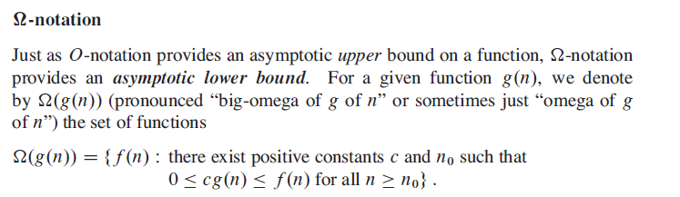
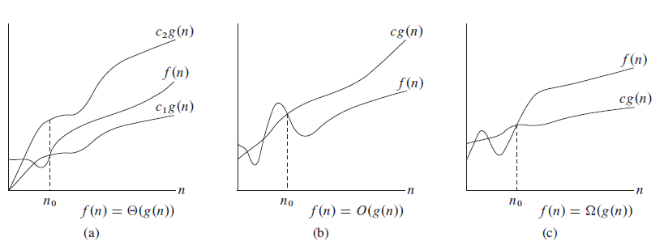
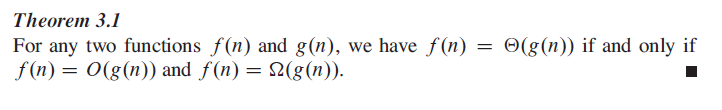
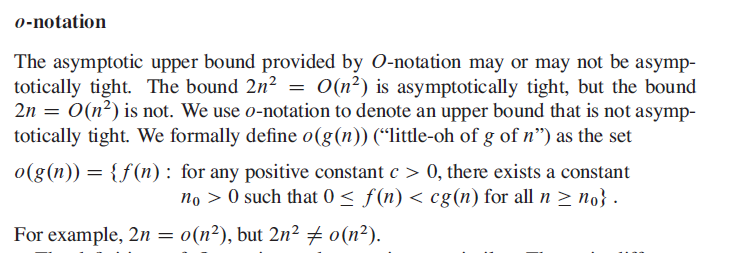
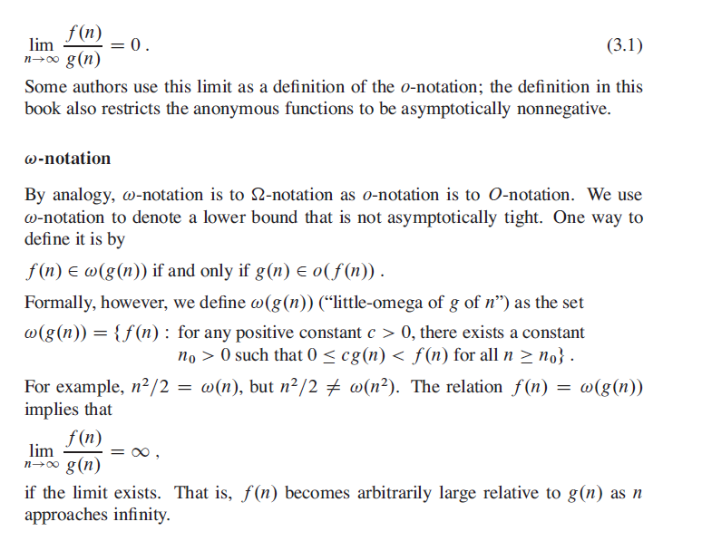

# Asymptotic analysis

### Definition

In mathematical analysis, asymptotic analysis, also known as asymptotics, is a method of describing limiting behavior.

### Theta notation

### O notation

We use O-notation to give an upper bound on a function, to within a constant
factor.

### Omega notation

### Little o notation

### Little omega notation

