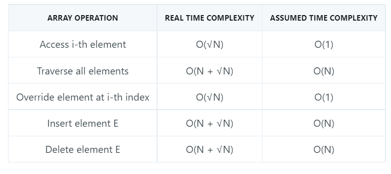
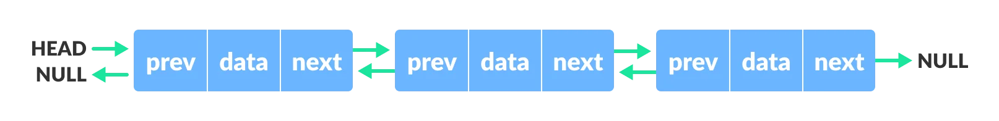

# Data structures

### Array

An array is a collection of items stored at contiguous memory
locations. The idea is to store multiple items of the same type together.
This makes it easier to calculate the position of each element by simply addi
ng an offset to a base value, i.e., the memory location of the firs
t element of the array (generally denoted by the name of the array).

#### Complexity

---

### Stack

A stack is a linear data structure that follows the principle of Last In
First Out (LIFO). This means the last element inserted inside the stack is
removed first.

---

### Queue

A queue is a useful data structure in programming. It is similar to the ticket queue outside a cinema hall, where the first person entering the queue is the first person who gets the ticket.

Queue follows the First In First Out (FIFO) rule - the item that goes in first is the item that comes out first.

### Circular Queue

A circular queue is the extended version of a regular queue where the last element is connected to the first element. Thus forming a circle-like structure.

### Priority Queue

A priority queue is a special type of queue in which each element is associated with a priority value. And, elements are served on the basis of their priority. That is, higher priority elements are served first.

However, if elements with the same priority occur, they are served according to their order in the queue.

### Deque

Deque or Double Ended Queue is a type of queue in which insertion and removal of elements can either be performed from the front or the rear. Thus, it does not follow FIFO rule (First In First Out).

---

### List

A linked list is a linear data structure that includes a series of connected nodes. Here, each node stores the data and the address of the next node. For example,

- Singly Linked List

- Doubly Linked List

We add a pointer to the previous node in a doubly-linked list. Thus, we can go in either direction: forward or backward.

- Circular Linked List

A circular linked list is a variation of a linked list in which the last element is linked to the first element. This forms a circular loop.

