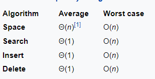

# Hash

### Hash table

The Hash table data structure stores elements in key-value pairs where

Key - unique integer that is used for indexing the values
Value - data that are associated with keys.

#### Complexity

---

### Hash Function

In a hash table, a new index is processed using the keys. And, the element corresponding to that key is stored in the index. This process is called hashing.

Let k be a key and h(x) be a hash function.

Here, h(k) will give us a new index to store the element linked with k.

---

### Hash function design

**Video (with collision solving)**

---

### Separate Chaining

Separate Chaining is one of the techniques that is used to resolve the collision. It is implemented using linked lists. This method combines a linked list with a hash table in order to resolve the collision. In this method, we put all the elements that hash to the same slot in the linked list.

In separate chaining, each slot of the hash table is a linked list. We will insert the element into a specific linked list to store it in the hash table. If there is any collision i.e. if more than one element after calculating the hashed value mapped to the same key then we will store those elements in the same linked list. Given below is the representation of the separate chaining hash table.

---

### Open addressing

The open addressing is another technique for collision resolution. Unlike chaining, it does not insert elements to some other data-structures. It inserts the data into the hash table itself. The size of the hash table should be larger than the number of keys.

There are three different popular methods for open addressing techniques. These methods are −

- Linear Probing
- Quadratic Probing
- Double Hashing

### Linear Probing

**Video**

### Quadratic Probing

**Video**

### Double Hashing

**Video**

