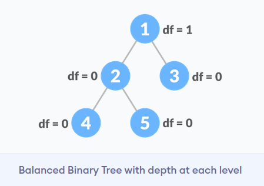
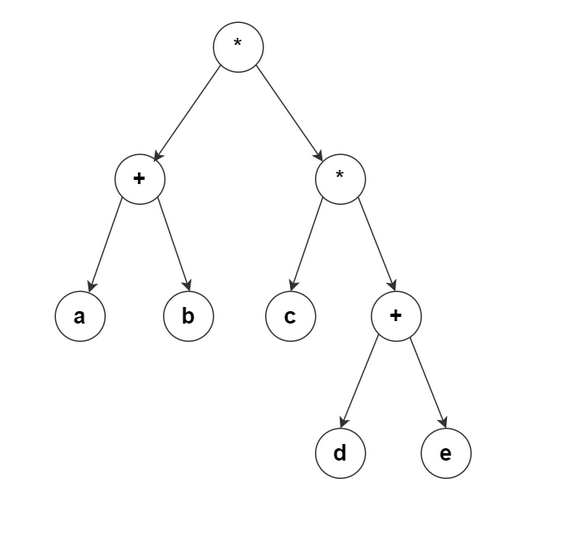
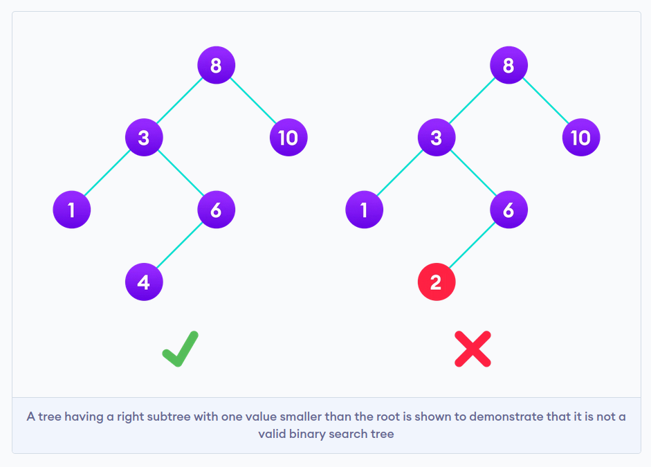

# Деревья

Дерево — это структура, в которой у каждого узла может быть ноль или более подузлов — «детей». Дерево является связным графом, который не содержит циклы, ребра графа не ориентированны и не взвешенны.

### Наивное бинарное дерево

Бинарное(двоичное) дерево поиска (дальше просто бинарное дерево). Бинарное дерево, это дерево в котором для любого узла выполняется следующее правило: потомки слева этого узла всегда меньше него, потомки справа — всегда больше. Следовательно, такое дерево очень легко превратить в сортированный массив, найти самое маленькое и самое большое значение, или же просто найти необходимое значение.

Допустим у нас есть следующее дерево:
Обычное бинарное дерево


Поиск минимального значения невероятно прост — это всегда самый левый узел, то есть мы пробегаем по всем потомкам, если у потомка есть левый лист, значит бежим по его потомкам. Как только мы видим, что потомков нет — вуаля, у нас самое маленькое значение:


Поиск минимального значения

Тоже самое с самым большим значением — оно всегда самое правое:


Поиск элемента тоже очень прост:

1. Как обычно начинаем с корневого элемента.
2. Проверяем или даный элемент — тот который нам нужен. Если да — возвращаем
3. Если нет: смотрим или он больше даного, или меньше. Идем к соответствующему листу
4. Если листов нет — элемента нет. Если есть — повторяем пункт 2.


#### Perfomance

| Algorithm | Average  | Worst case |
| --------- | -------- | ---------- |
| Space     | O(n)     | O(n)       |
| Search    | O(log n) | O(log n)   |
| Insert    | O(log n) | O(log n)   |
| Delete    | O(log n) | O(log n)   |

### Сбалансированные деревья

Сбалансированное бинарное дерево, также называемое сбалансированным по высоте бинарным деревом, определяется как бинарное дерево, в котором высота левого и правого поддеревьев любого узла отличается не более чем на 1.

Ниже приведены условия для сбалансированного по высоте бинарного дерева:

1. разница между левым и правым поддеревом для любого узла не более единицы
2. левое поддерево сбалансировано
3. правое поддерево сбалансировано




### Дерево выражений

Бинарное дерево выражений это бинарное дерево чьи листья являются операндами, такими как константы или имена переменных, а другие узлы содержат операторы.

Например, постфиксная запись a b + c d e + * * приводит к следующему дереву выражений. Соответствующее инфиксное обозначение (a+b)*(c*(d+e)) который может быть получен путем обхода дерева выражений в мода. Однако в начале и в конце каждого выражения должны быть добавлены открывающая и закрывающая скобки (каждое поддерево представляет подвыражение).



### BST (Двоичное дерево поиска)

Двоичное дерево поиска — это структура данных, которая позволяет нам быстро поддерживать отсортированный список чисел.

- Оно называется бинарным деревом, потому что каждый узел дерева имеет не более двух дочерних элементов.
- Оно называется деревом поиска, потому что его можно использовать для поиска присутствия числа за время O(log(n)).

Свойства, которые отделяют бинарное дерево поиска от обычного бинарного дерева:

1. Все узлы левого поддерева меньше корневого узла
2. Все узлы правого поддерева больше, чем корневой узел
3. Оба поддерева каждого узла также являются BST, т.е. они обладают двумя вышеуказанными свойствами.



#### Search Operation

**Algorithm:**
```
If root == NULL 
    return NULL;
If number == root->data 
    return root->data;
If number < root->data 
    return search(root->left)
If number > root->data 
    return search(root->right)
```

#### Insert Operation

**Algorithm:**

```
If node == NULL 
    return createNode(data)
if (data < node->data)
    node->left  = insert(node->left, data);
else if (data > node->data)
    node->right = insert(node->right, data);  
return node;
```

#### Perfomance

| Operation | Best Case Complexity | Average Case Complexity | Worst Case Complexity |
| --------- | -------------------- | ----------------------- | --------------------- |
| Search    | O(log n)             | O(log n)                | O(n)                  |
| Insertion | O(log n)             | O(log n)                | O(n)                  |
| Deletion  | O(log n)             | O(log n)                | O(n)                  |

Here, n is the number of nodes in the tree.

The space complexity for all the operations is O(n).

### AVL-деревья

Дерево AVL — это самобалансирующееся двоичное дерево поиска, в котором каждый узел содержит дополнительную информацию, называемую коэффициентом баланса, значение которого равно -1, 0 или +1.

Дерево АВЛ получило свое название в честь его изобретателей Георгия Адельсона-Вельского и Ландиса.

В каждом узле АВЛ-дерева, помимо ключа, данных и указателей на левое и правое поддеревья (левого и правого сыновей), хранится показатель баланса – разность высот правого и левого поддеревьев. В некоторых реализациях этот показатель может вычисляться отдельно в процессе обработки дерева тогда, когда это необходимо.


#### Perfomance 

| Algorithm | Average     | Worst case  |
| --------- | ----------- | ----------- |
| Space     | Θ (n)       | O (n)       |
| Search    | Θ (log ⁡ n) | O (log ⁡ n) |
| Insert    | Θ (log ⁡ n) | O (log ⁡ n) |
| Delete    | Θ (log ⁡ n) | O (log ⁡ n) |


### Красно-чёрные деревья 

АВЛ-деревья исторически были первым примером использования
сбалансированных деревьев поиска. В настоящее время более популярны красно-черные деревья (КЧ-деревья). Изобретателем красно-черного дерева считается немецкий ученый Рудольф Байер. Название эта структура данных получила в статье Леонидаса Гимпаса и Роберта Седжвика 1978 года.
КЧ-деревья – это двоичные деревья поиска, каждый узел которых хранит дополнительное поле color, обозначающее цвет: красный или черный, и для которых выполнены приведенные ниже свойства.

Будем считать, что если left или right равны NULL, то это «указатели» на фиктивные листья. Таким образом, все узлы – внутренние (нелистовые).
Свойства КЧ-деревьев:

1. каждый узел либо красный, либо черный;
2. каждый лист (фиктивный) – черный;
3. если узел красный, то оба его сына – черные;
4. все пути, идущие от корня к любому фиктивному листу, содержат одинаковое количество черных узлов;
5. корень – черный.


**Video**

[](https://www.youtube.com/watch?v=qvZGUFHWChY&list=PL9xmBV_5YoZNqDI8qfOZgzbqahCUmUEin)


### Двоичная куча

Двоичная куча - двоичное дерево, для которого выполнены три условия:

- Значение в любой вершине не меньше, чем значения её потомков.
- Глубина листьев (расстояние до корня) отличается не более чем на 1 уровень.
- Последний уровень заполняется слева направо.

Существуют также кучи, где значение в любой вершине, наоборот, не больше, чем значения её потомков. Структура данных как двоичная куча используется в основном в алгоритмах сортировки.

Пример двоичной кучи:


Над кучей можно выполнять следующие операции:

1. Добавить элемент в кучу;
2. Исключить максимальный элемент из кучи;
3. Изменить значение любого элемента.


