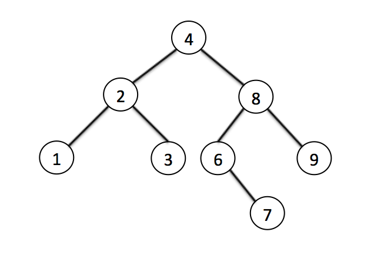
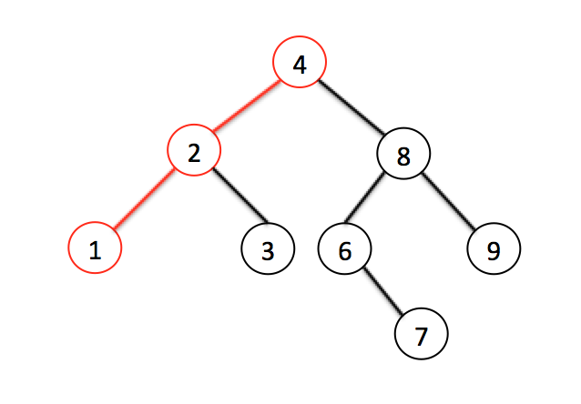
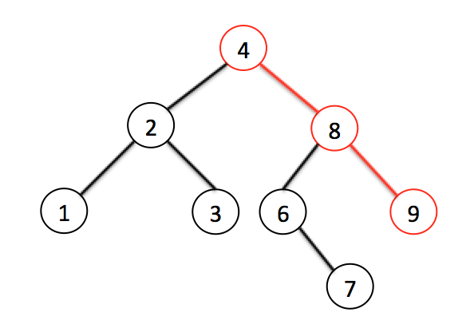
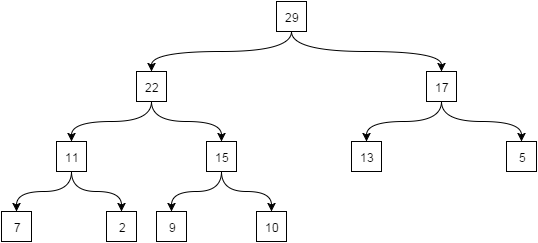

# Деревья

Дерево — это структура, в которой у каждого узла может быть ноль или более подузлов — «детей». Дерево является связным графом, который не содержит циклы, ребра графа не ориентированны и не взвешенны.

### Наивное бинарное дерево

Бинарное(двоичное) дерево поиска (дальше просто бинарное дерево). Бинарное дерево, это дерево в котором для любого узла выполняется следующее правило: потомки слева этого узла всегда меньше него, потомки справа — всегда больше. Следовательно, такое дерево очень легко превратить в сортированный массив, найти самое маленькое и самое большое значение, или же просто найти необходимое значение.

Допустим у нас есть следующее дерево:
Обычное бинарное дерево

Поиск минимального значения невероятно прост — это всегда самый левый узел, то есть мы пробегаем по всем потомкам, если у потомка есть левый лист, значит бежим по его потомкам. Как только мы видим, что потомков нет — вуаля, у нас самое маленькое значение:

Поиск минимального значения

Тоже самое с самым большим значением — оно всегда самое правое:

Поиск элемента тоже очень прост:

1. Как обычно начинаем с корневого элемента.
2. Проверяем или даный элемент — тот который нам нужен. Если да — возвращаем
3. Если нет: смотрим или он больше даного, или меньше. Идем к соответствующему листу
4. Если листов нет — элемента нет. Если есть — повторяем пункт 2.

#### Perfomance

| Algorithm | Average  | Worst case |
| --------- | -------- | ---------- |
| Space     | O(n)     | O(n)       |
| Search    | O(log n) | O(log n)   |
| Insert    | O(log n) | O(log n)   |
| Delete    | O(log n) | O(log n)   |

### AVL-деревья

АВЛ-деревом называется такое дерево поиска, в котором для любого его узла высоты левого и правого поддеревьев отличаются не более, чем на 1. Эта структура данных разработана советскими учеными Адельсон-Вельским Георгием Максимовичем и Ландисом Евгением Михайловичем в 1962 году.

В каждом узле АВЛ-дерева, помимо ключа, данных и указателей на левое и правое поддеревья (левого и правого сыновей), хранится показатель баланса – разность высот правого и левого поддеревьев. В некоторых реализациях этот показатель может вычисляться отдельно в процессе обработки дерева тогда, когда это необходимо.

#### Perfomance 

| Algorithm | Average     | Worst case  |
| --------- | ----------- | ----------- |
| Space     | Θ (n)       | O (n)       |
| Search    | Θ (log ⁡ n)  | O (log ⁡ n)  |
| Insert    | Θ (log ⁡ n)  | O (log ⁡ n)  |
| Delete    | Θ (log ⁡ n)  | O (log ⁡ n)  |

### Красно-чёрные деревья 

АВЛ-деревья исторически были первым примером использования
сбалансированных деревьев поиска. В настоящее время более популярны красно-черные деревья (КЧ-деревья). Изобретателем красно-черного дерева считается немецкий ученый Рудольф Байер. Название эта структура данных получила в статье Леонидаса Гимпаса и Роберта Седжвика 1978 года.
КЧ-деревья – это двоичные деревья поиска, каждый узел которых хранит дополнительное поле color, обозначающее цвет: красный или черный, и для которых выполнены приведенные ниже свойства.

Будем считать, что если left или right равны NULL, то это «указатели» на фиктивные листья. Таким образом, все узлы – внутренние (нелистовые).
Свойства КЧ-деревьев:

1. каждый узел либо красный, либо черный;
2. каждый лист (фиктивный) – черный;
3. если узел красный, то оба его сына – черные;
4. все пути, идущие от корня к любому фиктивному листу, содержат одинаковое количество черных узлов;
5. корень – черный.

### Двоичная куча

Двоичная куча - двоичное дерево, для которого выполнены три условия:

- Значение в любой вершине не меньше, чем значения её потомков.
- Глубина листьев (расстояние до корня) отличается не более чем на 1 уровень.
- Последний уровень заполняется слева направо.

Существуют также кучи, где значение в любой вершине, наоборот, не больше, чем значения её потомков. Структура данных как двоичная куча используется в основном в алгоритмах сортировки.

Пример двоичной кучи:

Над кучей можно выполнять следующие операции:

1. Добавить элемент в кучу;
2. Исключить максимальный элемент из кучи;
3. Изменить значение любого элемента.

